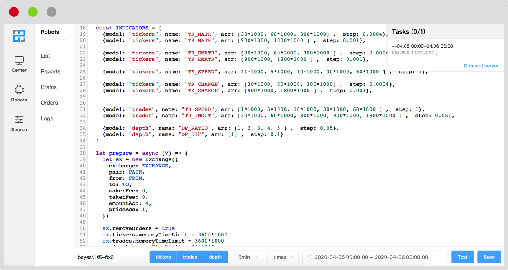

<div align=center style="padding:40px 0">

</div>


Vtrade是一个基于Nodejs编写的量化交易回测框架，它也是量化交易项目Chainbrain的基础设施框架（不包括可视化操作系统、算法及策略、交易所API接入），并已投入实盘运行。

<div align=center style="padding:40px 0">

</div>

### 特性

- 基于事件驱动模型设计：可实现对交易事件的极速响应
- 可无缝接入实盘：通过继承关键类，重载动作执行方法接入交易所API，无需修改任何代码即可接入实盘交易
- 可拓展性强：开发者可自行定制模块以实现更多高级功能
- 可实现ticker级别微观数据的回测：回测的数据输入源可支持包括但不限于ticker,depth,trades，理论上开发者可以将任何可采集到的时间维度上的市场实盘数据集成到回测系统中
- 开放式的回测数据采集模型：开发者可自定义回测LOG，用于针对性地生成个性化的数据报表用于优化策略性能


### 快速开始
```javascript
// 伪代码
let ex = new Exchange({
  exchange: 'exchangeName',
  pair: 'pairName',
  from : 'usdt',
  to: 'btc',
  makerFee: -0.01,
  takerFee: 0.01,
  amountAcc: 2,
  priceAcc: 4
})

ex.registerOrder(Order) // 注册一个订单模型（现货、合约等）

let robot = new Robot()
robot.registerExchange(ex) // 注册一个交易所

robot.registerPrepare((V) => {
  // 机器人初始化准备工作
})

// 策略主函数，当事件发生时被回调
robot.registerPolicy((V, e) => {
  // 策略执行
  V.ex.buy(...)
  V.ex.sell(...)
})

// 事件驱动策略执行
events.emit('事件名', '事件数据') // 发出一个事件，回调执行policy逻辑

// 通过robot对象方法采集任何你想要的数据
...

```

### 补充说明
本项目暂无推广计划，所以无法提供详细文档
